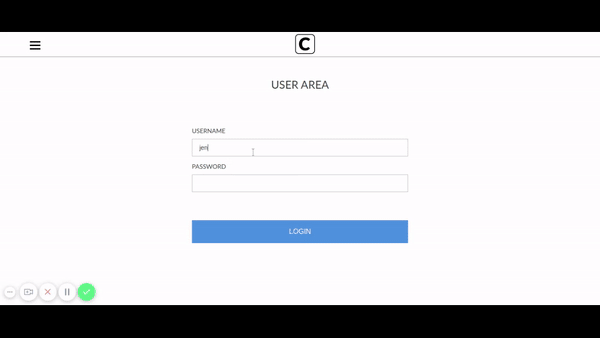

<!-- Inspired by https://github.com/jennifertakagi/news-app-react -->

<!-- PROJECT SHIELDS -->
[![Contributors][contributors-shield]][contributors-url]
[![Forks][forks-shield]][forks-url]
[![Stargazers][stars-shield]][stars-url]
[![Issues][issues-shield]][issues-url]
[![MIT License][license-shield]][license-url]
[![LinkedIn][linkedin-shield]][linkedin-url]


<!-- PROJECT LOGO -->
<br />
<p align="center">
  <a href="https://github.com/jennifertakagi/news-app-react">
    
  </a>

  <h3 align="center">News App</h3>

  <p align="center">
   Login in the app, choose your interest and check some news!
    <br />
    <a href="https://github.com/jennifertakagi/news-app-react"><strong>Explore the docs »</strong></a>
    <br />
    <br />
    <a href="https://news-app-react.vercel.app">View Demo</a>
    ·
    <a href="https://github.com/jennifertakagi/news-app-react/issues">Report Bug</a>
    ·
    <a href="https://github.com/jennifertakagi/news-app-react/issues">Request Feature</a>
  </p>
</p>


<!-- TABLE OF CONTENTS -->
<details open="open">
  <summary>Table of Contents</summary>
  <ol>
    <li>
      <a href="#about-the-project">About The Project</a>
      <ul>
        <li><a href="#built-with">Built With</a></li>
      </ul>
    </li>
    <li>
      <a href="#getting-started">Getting Started</a>
      <ul>
        <li><a href="#prerequisites">Prerequisites</a></li>
        <li><a href="#installation">Installation</a></li>
      </ul>
    </li>
    <li><a href="#usage">Usage</a></li>
    <li><a href="#roadmap">Roadmap</a></li>
    <li><a href="#contributing">Contributing</a></li>
    <li><a href="#license">License</a></li>
    <li><a href="#contact">Contact</a></li>
  </ol>
</details>


<!-- ABOUT THE PROJECT -->
## About The Project

[![Product Name Screen Shot][product-screenshot]](https://news-app-react.vercel.app)

A news application, without backend implementation.

Features:
* Login.
* Choose your interests.
* Check the news on desktop and mobile device.


### Built With

* [React](https://pt-br.reactjs.org/)


<!-- GETTING STARTED -->
## Getting Started

### Prerequisites

* npm
  ```sh
  npm install npm@latest -g
  ```

* yarn
  ```sh
  npm install --global yarn
  ```

### Installation

1. Clone the repo
   ```sh
   git clone https://github.com/jennifertakagi/news-app-react.git
   ```
2. Install packages
   ```sh
   yarn | npm install
   ```
3. Enter your API in `config.js`
   ```sh
   yarn start | npm run start
   ```


<!-- USAGE EXAMPLES -->
## Usage

<p align="left">
   
</p>


<!-- ROADMAP -->
## Roadmap

See the [open issues](https://github.com/jennifertakagi/news-app-react/issues) for a list of proposed features (and known issues).


<!-- CONTRIBUTING -->
## Contributing

Contributions are what make the open source community such an amazing place to be learn, inspire, and create. Any contributions you make are **greatly appreciated**.

1. Fork the Project
2. Create your Feature Branch (`git checkout -b feature/AmazingFeature`)
3. Commit your Changes (`git commit -m 'Add some AmazingFeature'`)
4. Push to the Branch (`git push origin feature/AmazingFeature`)
5. Open a Pull Request


<!-- LICENSE -->
## License

Distributed under the MIT License. See `LICENSE` for more information.


<!-- CONTACT -->
## Contact

Jennifer Takagi - [@jennitakagi](https://twitter.com/jennitakagi)

[Check out the demo project](https://news-app-react.vercel.app)


<!-- ACKNOWLEDGEMENTS -->
## Acknowledgements
* [GitHub Emoji Cheat Sheet](https://www.webpagefx.com/tools/emoji-cheat-sheet)
* [Img Shields](https://shields.io)
* [Choose an Open Source License](https://choosealicense.com)


<!-- MARKDOWN LINKS & IMAGES -->
<!-- https://www.markdownguide.org/basic-syntax/#reference-style-links -->
[contributors-shield]: https://img.shields.io/github/contributors/jennifertakagi/news-app-react.svg?style=for-the-badge
[contributors-url]: https://github.com/jennifertakagi/news-app-react/graphs/contributors
[forks-shield]: https://img.shields.io/github/forks/jennifertakagi/news-app-react.svg?style=for-the-badge
[forks-url]: https://github.com/jennifertakagi/news-app-react/network/members
[stars-shield]: https://img.shields.io/github/stars/jennifertakagi/news-app-react.svg?style=for-the-badge
[stars-url]: https://github.com/jennifertakagi/news-app-react/stargazers
[issues-shield]: https://img.shields.io/github/issues/jennifertakagi/news-app-react.svg?style=for-the-badge
[issues-url]: https://github.com/jennifertakagi/news-app-react/issues
[license-shield]: https://img.shields.io/github/license/jennifertakagi/news-app-react.svg?style=for-the-badge
[license-url]: https://github.com/jennifertakagi/news-app-react/blob/master/LICENSE.txt
[linkedin-shield]: https://img.shields.io/badge/-LinkedIn-black.svg?style=for-the-badge&logo=linkedin&colorB=555
[linkedin-url]: https://linkedin.com/in/jennifertakagi
[product-screenshot]: docs/screenshot.png